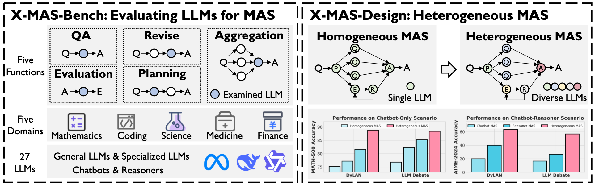

# X-MAS: Towards Building Multi-Agent Systems with Heterogeneous LLMs



## 🔥 News
- [2025/05/23] See our preprint paper in [ArXiv](https://arxiv.org/pdf/2505.16997).

## X-MAS-Bench

1. Specify your model configs in `./configs/X-MAS_Bench_config.json`:
```
"gpt-4o-mini-2024-07-18": {
        "model_list": [
            {"model_name": "gpt-4o-mini-2024-07-18", "model_url": "http://a.b.c.d:e/v1", "api_key": "xyz"}
        ],
        "max_workers_per_model": 10
    }
```

2. Inference on a dataset/several datasets (the outputs will be saved under "./X-MAS-Bench/results/")
```
# bash scripts/infer_X-MAS_Bench.sh
  python X-MAS-Bench/infer_direct.py --model_name <model_name> --model_config <config_path> --test_dataset_name <dataset_name>
```

3. Evaluate on a dataset/several datasets (the outputs will be saved under "./X-MAS-Bench/results/")
```
# bash scripts/eval_X-MAS_Bench.sh
python X-MAS-Bench/eval_bench.py --model_name <eval_model_name> --model_config <config_path> --dataset_name <dataset_name> --infer_name <infer_name> --eval_mode bench-test
# We use llama-3.1-70b-instruct as <eval_model_name>
```

Note that we release the experimental results of the X-MAS-Bench in [Google Drive](https://drive.google.com/file/d/1oukYZLDOuc98i-ICkoZ6OYME9a7-AuH1/view?usp=drive_link).
You can download the .zip file named results.zip to the "./X-MAS-Bench/results/" path and unzip it.

## X-MAS-Design

1. Specify your model configs in `./configs/X-MAS_Design_config.json`:
```
"gpt-4o-mini-2024-07-18": {
        "model_list": [
            {"model_name": "gpt-4o-mini-2024-07-18", "model_url": "http://a.b.c.d:e/v1", "api_key": "xyz"}
        ],
        "max_workers_per_model": 10
    }
```

2. To see if the codebase is executable (e.g., vanilla)
```
python X-MAS-Design/inference_X-MAS.py --method_name vanilla --debug
```

3. To inference on a dataset/several datasets (the outputs will be saved under "./X-MAS-Design/results/")
```
# Inference on the whole dataset (Parallel)
python X-MAS-Design/inference_X-MAS.py --method_name <method_name> --model_name <model_name> --test_dataset_name <test_dataset_name> --model_api_config <model_api_config>


# Or inference on the whole dataset (Sequential)
python X-MAS-Design/inference_X-MAS.py --method_name <method_name> --model_name <model_name> --test_dataset_name <test_dataset_name> --model_api_config <model_api_config> --sequential

# bash scripts/infer_X-MAS_Design.sh
```

4. To evaluate on a dataset/several datasets (the outputs will be saved under "./X-MAS-Design/results/")
```
bash scripts/eval_X-MAS_Design.sh
```